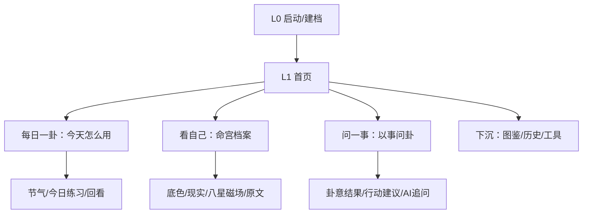

# 观心 UI 结构标准 V1

> 更新时间：2026-06-30  
> 用途：在继续改 `index.html` 前，先统一页面层级、交互结构和视觉边界。此文档优先级高于临时 UI 灵感。

## 1. 当前结论

这次不能继续做“装饰性中国风”。问题不在某个卡片好不好看，而在页面结构没有稳定分层：用户不知道自己在哪、这一页先看什么、看完下一步做什么。

因此下一轮 UI 的目标不是做更复杂，而是做更清楚：

- 首页只负责分流，不承载长解释。
- 每日内容统一收进“每日一卦”层级。
- 命宫档案只负责“认识自己”，不和每日一卦抢日更价值。
- 问一事只负责“一个问题的当下判断”，AI 追问后置。
- 图鉴、历史、工具是下沉层，不进入首屏主路径。

## 2. 产品信息架构

## 3. 页面层级规则

### L0：启动与建档

作用：建立仪式感和个人档案，不解释所有功能。

必须保留：

- 一个主按钮：开始探索。
- 轻量说明：先填写生辰信息，建立个人观察基准。
- 不出现每日、问卦、图鉴等多个并列入口。

### L1：首页

作用：让用户在 5 秒内知道“今天先去哪”。

首页只允许出现：

- 今日主入口：每日一卦。
- 两个次入口：看自己、问一事。
- 一个下沉入口：更多。

首页禁止：

- 长段传统文化说明。
- 多个同等权重大卡片。
- 把产品内部思考写给用户看，例如“主路径收口”“下沉入口”等。

### L2：三条主路径

每日一卦：

- 面向日常复访。
- 承载节气、今日练习、回看提醒。
- 文案必须因卦而异，不做通用模板。

看自己：

- 面向个人底色理解。
- 命宫固定，因此不能包装成每日变化。
- 今日练习若出现，必须结合当天节律或当日卦，不只由命宫生成。

问一事：

- 面向具体问题。
- 结果页先给结论和动作，再给术语。
- AI 追问默认隐藏，用户触发后出现。

### L3：学习与工具

图鉴、历史、数字起卦、八星磁场说明属于 L3。

它们可以有深度，但不能抢主路径首屏。真正想学的人通过标签、展开、弹层进入；只想看解读的人不被迫阅读。

## 4. 推荐采用的结构方案

下一轮建议采用“山门式三路径”结构：

- 顶部是当前状态：今天适合先看什么。
- 中间是三扇门：每日一卦、看自己、问一事。
- 底部是更多：图鉴、历史、工具。

理由：

- 比大卡片列表更像产品主页。
- 比卷轴官网更适合手机 SPA。
- 能清楚表达层级，不会让用户误以为所有卡片同等重要。

## 5. 视觉方向

采用“雾山五行式硬核水墨的轻量移动端表达”，但只取气质，不照搬动画风格：

- 基底：米黄宣纸、淡墨晕染、少量枯笔飞白。
- 骨架：墨色铁线描，增强结构感。
- 主色：石青，用于静心、主路径和选中态。
- 点色：低饱和朱砂，只用于主 CTA 和关键提醒。
- 金色：只作为细线或卦爻隐纹，不能大面积鎏金。
- 卡片：减少普通圆角大卡片，改成“门、签、轴、帖、盘”等不同结构。

## 6. 文本系统

每条解读必须有三层，但界面默认只露前两层：

- 卦意骨架：这卦本身在说什么。
- 现实翻译：这件事落到现实是什么状态。
- 情绪承接：用户现在可以怎么稳住自己。

默认呈现：

- 一句话判断。
- 一个当下落点。
- 一个可做动作。
- 一个先别做。

后置展开：

- 卦辞象辞。
- 互卦变卦。
- 术语教学。
- 传统文化延伸。

## 7. 交互标准

- 所有关键页面左上角必须有返回。
- 手机右滑返回可以保留，但不能代替可见返回按钮。
- 首页底部可以有导航，但最多 4 项：今日、自己、问事、更多。
- 卡片点击必须有 100ms 内反馈。
- 展开内容必须可收起，且关闭按钮始终可见。
- 长文不直接铺满页面，必须通过分段、标签、折叠或弹层承载。

## 8. 验收门槛

每次 UI 改完必须回答：

1. 用户能不能一眼知道当前是哪一页？
2. 用户能不能知道这一页先看哪一块？
3. 用户看完有没有明确下一步？
4. 页面是否还能稳定返回？
5. 首屏是否少于 3 个同等权重入口？
6. 术语是否默认后置？
7. 是否仍然服务“八卦为体，梅花为用，命宫为人，五行为翻译层，节气为留存层”？

## 9. 下一步开发顺序

P0：

- 确认三套结构原型中的一个。
- 将首页改成“山门式三路径”或确认的替代方案。
- 把每日相关内容移入每日一卦层级。
- 修正首页底部导航与更多入口。

P1：

- 重做每日一卦结果页结构。
- 优化问一事结果页，让 AI 追问只在用户触发后出现。
- 命宫档案首屏继续减重，保留四层切换。

P2：

- 视觉细节强化：水墨纹理、卦爻动效、转场。
- 图鉴/历史/工具的学习层体验。
- 微社交和分享卡片 2.0。

## 10. 2026-06-30 执行状态

本轮已确认并落地 A「山门式三路径」作为主应用结构。

已完成：

- P0：首页改为“今日主门 + 三扇门 + 下沉更多”。
- P0：每日、命宫、问事成为三条清晰主路径。
- P1：每日一卦、问事结果、命宫档案完成首屏减重。
- P1：AI 追问默认后置，生成后再展开细分主题。
- P2：首页、结果页、AI 弹窗完成第一轮水墨质感和移动端触控收口。
- P2：摇签从“必须长按”改为“轻点或长按均可”，避免用户误以为功能无响应。

仍后置：

- 六十四卦完整内容库系统化重写。
- 分享卡片 2.0 与微社交。
- 单文件架构拆分。
